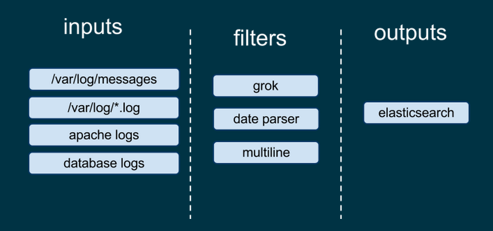
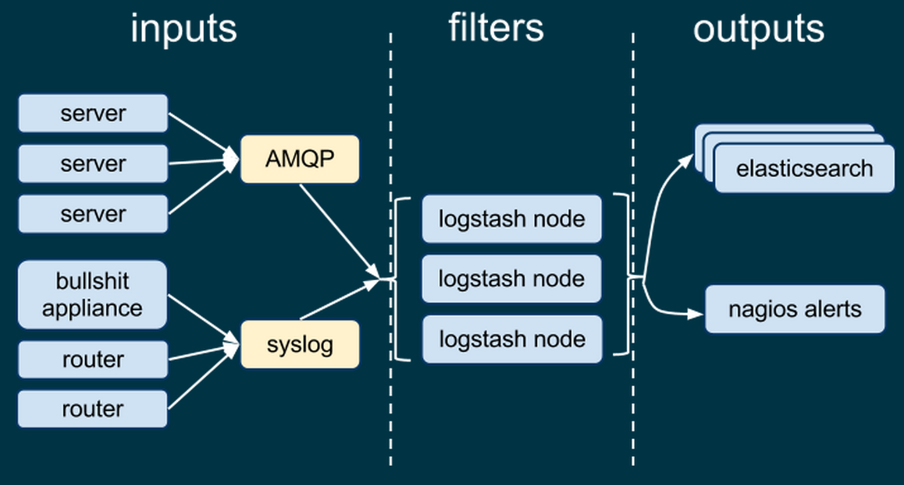

!SLIDE transition=fade

So how does logstash fit in?

.notes TODO

!SLIDE transition=fade 
# Goals: Log Life Cycle

* Take events.
* Massage them.
* Put them somewhere else.

!SLIDE transition=fade 
# Goals: User Experience

* Fit your infrastructure
* Be extentable
* Be well documented

!SLIDE transition=fade 
# logstash agent

inputs | filters | outputs

!SLIDE transition=fade 
# logstash agent

* move logs
* process logs

!SLIDE transition=fade 
# logstash agent - inputs

* inputs are sources of events.
* 23 input plugins today.
* files, syslog, log4j, xmpp, irc, etc
 
!SLIDE transition=fade 
# logstash agent - filters

* filters let you modify/drop events
* 18 filter plugins today.
* date parsing, text parsing, anonymization
* multiline merging, etc

!SLIDE transition=fade 
# logstash agent - outputs

* outputs let you send events outside the agent
* 40 output plugins today.
* storage, graphing systems, monitoring systems, transportation

!SLIDE transition=fade 
# common example

* /var/log/*.log (file input)
* grok filter (parse said logs)
* date filter (normalize the date)
* elasticsearch output (for storage/search/analytics)

!SLIDE transition=fade center fullwidth

## one agent, one server

!SLIDE transition=fade center fullwidth

## many nodes, tiered deployment

!SLIDE transition=fade 
# common case

* emit logs to a local file
* logstash slurps them up
* ships to elasticsearch
* search/analytics with elasticsearch

!SLIDE transition=fade 
# logstash agent - transport

* A few plugins are for transporting logs
* redis, amqp, stomp, tcp, zeromq, jabber, irc, syslog
* This lets you pipe two remote logstash agents together

!SLIDE transition=fade 
# logstash analytics 

TBD: kibana screenshots

